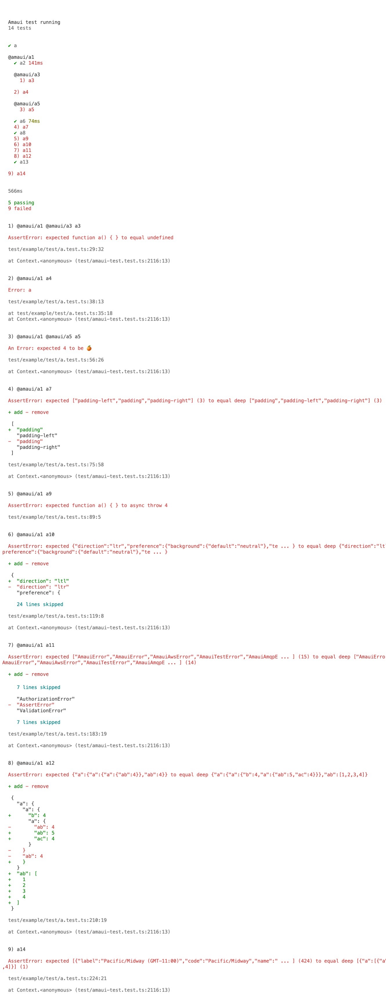

</br >
</br >

<p align='center'>
  <a target='_blank' rel='noopener noreferrer' href='#'>
    
  </a>
</p>

<h1 align='center'>AMAUI Test</h1>

<p align='center'>
  Test suite for front-end and back-end
</p>

<br />

<h3 align='center'>
  <sub>MIT license&nbsp;&nbsp;&nbsp;&nbsp;</sub>
  <sub>Production ready&nbsp;&nbsp;&nbsp;&nbsp;</sub>
  <sub>46.9kb gzipped&nbsp;&nbsp;&nbsp;&nbsp;</sub>
  <sub>100% test cov&nbsp;&nbsp;&nbsp;&nbsp;</sub>
  <sub>Browser and Nodejs</sub>
</h3>

<p align='center'>
    <sub>Very simple code&nbsp;&nbsp;&nbsp;&nbsp;</sub>
    <sub>Modern code&nbsp;&nbsp;&nbsp;&nbsp;</sub>
    <sub>Junior friendly&nbsp;&nbsp;&nbsp;&nbsp;</sub>
    <sub>Typescript&nbsp;&nbsp;&nbsp;&nbsp;</sub>
    <sub>Made with :yellow_heart:</sub>
</p>

<br />

## Getting started

### Add

```sh
  // yarn
  yarn add @amaui/test --dev

  // npm
  npm install @amaui/test --dev
```

### Use

#### **Nodejs**

You can have amaui-test options either in package.json in 'amaui-test' property or amaui-test.options.js file in root directory, where `amaui-test` command will be made.

In nodejs on amaui-test run errors amaui-test exits the process, so it's all good if the command is flow dependent.

*amaui-test.options.js*

```javascript
  module.exports = {
    imports: [
      'ts-node/register/transpile-only'
    ],
    files: [
      'test/**/*.test.ts'
    ]
  }
```
or

*package.json*

```javascript
  {
    "scripts": {
      test: "amaui-test"
    },
    "amaui-test": {
      imports: [
        'ts-node/register/transpile-only'
      ],
      files: [
        'test/**/*.test.ts'
      ]
    }
  }
```

And with yarn test or npm test command amaui-test will run all the tests based on the amaui-test options

```javascript
  yarn test
```

#### **Browser**

Make an AmauiTest instance, which will prepare the environment, write all the tests below it, and run the tests with `amauiTest.run()` method, which on errors throws an error, so if the tests passing is flow dependent, running tests will obviously stop the method having thrown an error on tests not having passed.

```javascript
  import { AmauiTest, assert } from '@amaui/test';
  import { wait } from '@amaui/utils';

  const amauiTest = new AmauiTest();

  to('a', () => {
    assert(4).eq(4);
  });

  group('@amaui/a1', () => {

    pre(async () => {
      await wait(140);

      throw new Error('a');
    });

    to('a2', async () => {
      await wait(140);

      assert(4).eq(4);
    });

    group('@amaui/a3', () => {

      to('a3', async () => {
        assert(function a() { }).eq(undefined);
      });

    });

    to('a4', () => {
      [1, 2, 3, 4].forEach(value => {
        assert(typeof value === 'number').true;

        throw new Error('a');
      });
    });

    group('@amaui/a5', () => {
      let a: any;

      pre(async () => {
        await wait(14);
      });

      preTo(async () => {
        await wait(140);

        a = 4;
      });

      to('a5', (resolve, reject) => {
        const error: any = new Error();

        // Added expected and expression message
        error.name = 'An Error';
        error.expected = 4;
        error.expression = 'to be 🍊';

        reject(error);
      });

    });

    to('a6', async () => {
      await wait(74);

      assert(4).eq(4);
    });

    to('a7', async () => {
      assert(['padding-left', 'padding', 'padding-right']).eql(['padding', 'padding-left', 'padding-right']);
    });

    to('a8', async resolve => {
      await wait(4);

      resolve();

      await wait(140);

      assert(4).eq(4);
    });

    to('a9', async () => {
      await assert(function a() { }).throwAsync(4);
    });

    to('a10', async () => {
      assert({
        "direction": "ltr",
        "preference": {
          "background": {
            "default": "neutral"
          },
          "text": {
            "default": "neutral"
          },
          "visual_contrast": {
            "default": "regular"
          }
        },
        "mode": "regular",
        "palette": {
          "accessibility": "regular",
          "visual_contrast": {
            "low": {
              "opacity": {
                "primary": 0.77,
                "secondary": 0.54,
                "tertiary": 0.27
              }
            }
          }
        }
      }).eql({
        "direction": "ltl",
        "preference": {
          "background": {
            "default": "neutral"
          },
          "text": {
            "default": "neutral"
          },
          "visual_contrast": {
            "default": "regular"
          }
        },
        "mode": "regular",
        "palette": {
          "accessibility": "regular",
          "visual_contrast": {
            "low": {
              "opacity": {
                "primary": 0.77,
                "secondary": 0.54,
                "tertiary": 0.27
              }
            }
          }
        }
      });
    });

    to('a11', async () => {
      const value = [
        'AmauiError',
        'AmauiError',
        'AmauiAwsError',
        'AmauiTestError',
        'AmauiAmqpError',
        'AuthenticationError',
        'AuthorizationError',
        'AssertError',
        'ValidationError',
        'PermissionError',
        'AmauiMongoError',
        'ConnectionError',
        'NotFoundError',
        'DeveloperError',
        'AmauiError',
      ];
      const value1 = [
        'AmauiError',
        'AmauiError',
        'AmauiAwsError',
        'AmauiTestError',
        'AmauiAmqpError',
        'AuthenticationError',
        'AuthorizationError',
        'ValidationError',
        'PermissionError',
        'AmauiMongoError',
        'ConnectionError',
        'NotFoundError',
        'DeveloperError',
        'AmauiError',
      ];

      assert(value).eql(value1);
    });

    to('a12', async () => {
      const value = {
        a: {
          a: {
            a: {
              ab: 4,
            },
          },
          ab: 4,
        },
      };
      const value1 = {
        a: {
          a: {
            b: 4,
            a: {
              ab: 5,
              ac: 4,
            },
          },
        },
        ab: [1, 2, 3, 4],
      };

      assert(value).eql(value1);
    });

    to('a13', async () => {
      assert(4).eq(4);
    });

    post(async () => {
      await wait(40);
    });

  });

  to('a14', async () => {
    assert(timezones).eql([{ a: [function a() { }, { a: 4 }, 4] }]);
  });

  await amauiTest.run();
```

Results logged in nodejs and browser (and with an option for HTML logs)



### Dev

Install

```sh
  yarn
```

Test

```sh
  yarn test
```

### Prod

Build

```sh
  yarn build
```

### Docs

Might be soon...
